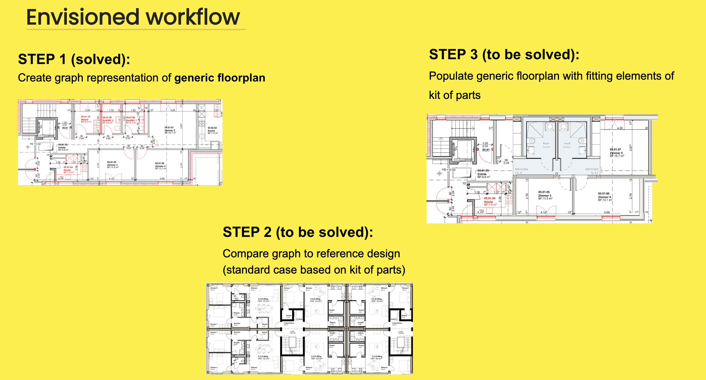

# 2025-AEC Hackathon

## Pattern Recognition with Graph Databases for Industrialized Construction

### Background
Implenia develops a system for the industrialized construction of housing projects. This system is based on a **Reference Design**: a flexible floorplan that can be stretched and adapted to different environments. The components of the system, known as the **Kit-of-Parts**, are predefined modular elements ("lego blocks") that can be combined to create a variety of configurations. These predefined components enable faster, more efficient construction while maintaining flexibility and adaptability.

### Problem
Let’s suppose we start from a random design that was not developed for industrialized construction. The challenge is: 

**How can we apply a kit-of-parts logic to any floorplan?**

This requires the ability to analyze, compare, and adapt arbitrary floorplans to align with the principles of industrialized construction, leveraging the Kit-of-Parts system.

### Envisioned Workflow
The envisioned workflow for addressing this challenge consists of three steps:

#### Step 1 (solved): Create Graph Representation of Generic Floorplan
A graph representation is generated for any generic floorplan, capturing spatial relationships and structural elements. This allows for a computational analysis of the design.

#### Step 2 (to be solved): Compare Graph to Reference Design
The graph representation of the generic floorplan is compared to a reference design, which serves as a standard case based on the Kit-of-Parts. The goal is to identify similarities and discrepancies, paving the way for alignment with industrialized construction principles.

#### Step 3 (to be solved): Populate Generic Floorplan with Fitting Elements of Kit-of-Parts
The generic floorplan is populated with compatible elements from the Kit-of-Parts, adapting it to meet the requirements of industrialized construction. This step ensures the design remains functional while adhering to predefined modular standards.

### Available Material
*(Content to be added later)*

### Team
- **Evangelos Pantazis** / ZHAW - Senior Researcher  
- **Jianpeng Cao** / HKU - Assistant Professor in the Department of Real Estate and Construction  
- **Konrad Graser** / ZHAW - Research/Program Manager  
- **Furio Sondrini** / Implenia - Digital Design and Innovation Manager  
- **Giulia Curletto** / Implenia - Digital Design and Innovation Manager

### Funding Partner
This project is supported by **Innosuisse - Swiss Innovation Agency Research Grant**: 108.408 IP-SBM.
